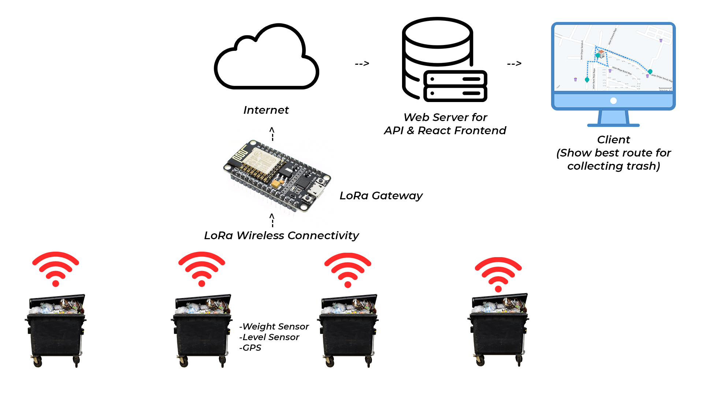
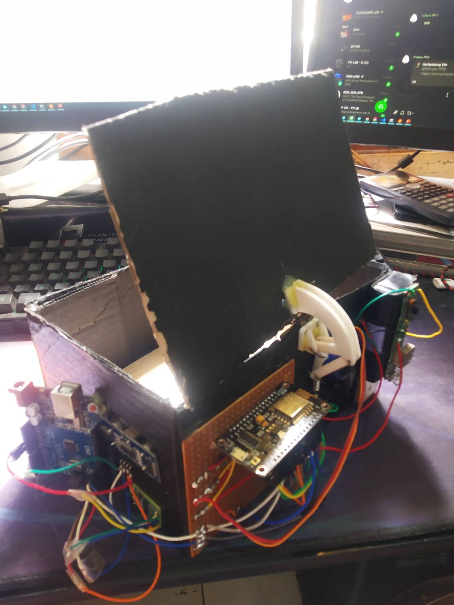
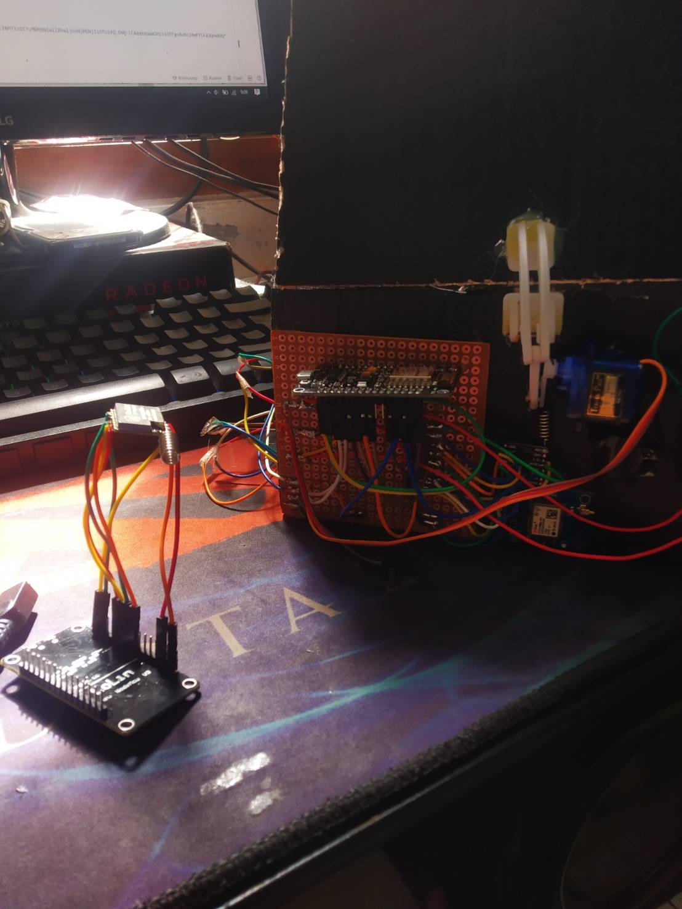
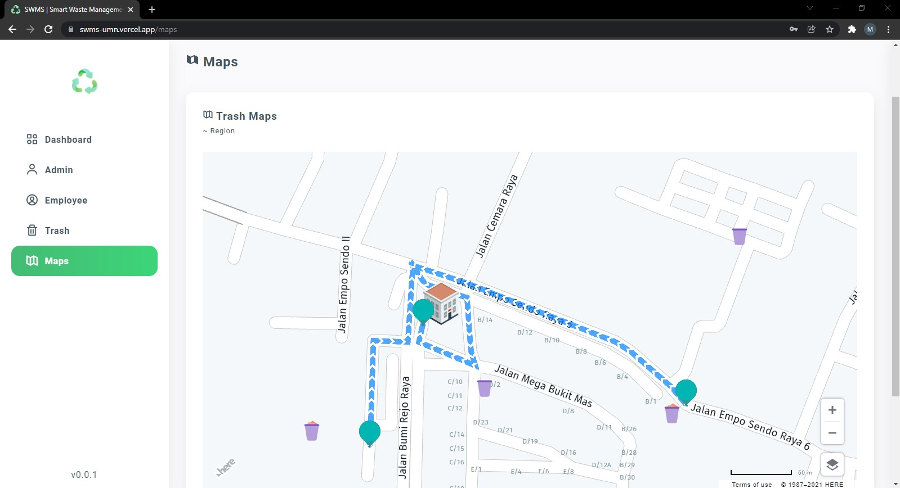

<h1 align="center">
  Smart Waste Management System (SWMS)
</h1>

  Smart city waste management system for our Mobile Pervasive Computing course final project.

### Preview of this system

  

### General Architecture

  

#

## How to make node device

### Hardware Architecture

  

### List of component
- Microcontroller ESP8266
- Microcontroller Arduino Uno
- Lora Module SX1278
- GPS Module Neo 6M
- Weight Sensor HX711+ 10kg Load cell
- Ultrasonic Sensor HC SR 04
- Servo SG40
- Battery 18650
- TP4056A

### List of component for gateway
- Microcontroller ESP8266
- Lora Module SX1278

Total budget (December 2021) = Rp. 356.200 (~ US $24,76)

### Component pin connection
1. Servo --> 
Orange : D3 (ESP8266),
Brown : GND (ESP8266),
Red : 3V3 (ESP8266)
2. Ultrasonic --> 
VCC : 5V (Arduino Uno),
Trig : Digital 5 (Arduino Uno),
Echo : Digital 6 (Arduino Uno),
GND : GND (Arduino Uno)
3. GPS --> 
GND : GND (ESP8266),
TX : D4 (ESP8266),
RX : D1 (ESP8266),
VCC : 3v3 (ESP8266)
4. HX711 --> 
VCC : 5V (Arduino Uno),
SCK : Digital 2 (Arduino Uno),
Data : Digital 3 (Arduino Uno),
GND : GND (Arduino Uno)
5. LoRa Wan --> 
GND : GND (ESP8266),
VCC : 3.3V (ESP8266),
NSS : D8 (ESP8266),
MOSI : D7 (ESP8266),
MISO : D6 (ESP8266),
CK : D5 (ESP8266),
RST : D0 (ESP8266),
DIO0 : D2 (ESP8266)
6. Serial Communication Arduino Uno and ESP8266 --> 
Digital 7 (Arduino Uno): TX (ESP8266),
Digital 8 (Arduino Uno): RX (ESP8266)

#

## How this work?
In this project, we use 2 microcontrollers, ESP8266 and Arduino Uno. The reason for using 2 microcontrollers simultaneously is because to supply power of weight sensor the HX711 module requires a larger current than the ESP8266 power regulator can provide. Therefore, if it is forced to run on esp8266, a bootloop will occur or it will restart continuously when the system boots. Arduino Uno's power regulator is larger than the ESP8266, therefore it can run the HX711 weight sensor module along with the ultrasonic sensor properly. But because we have implemented esp8266 in our prototype, we made it so that esp8266 and arduino uno can communicate to send sensor data. But if you want to save space, budget and efficiency, you can only use Arduino Uno.

For communication between the ESP8266 and Arduino Uno, use serial communication with a baud rate of 9600. Serial communication will happen every 3 seconds between Arduino Uno and Esp8266 to update esp8266 sensor data. And the lora frequency used is 915 MHz. To update data to API server will be done every 5 seconds by request by gateway. Then the gateway will request data one by one from the node so that data collisions do not occur (lora packet collosion -> for more details I have simulated packet collisions in LoRa communication which can be seen on).

For lora module with esp8266 using SPI communication protocol between the two. So the plot of Arduino Uno will send serial communication for weight sensor and Ultrasonic with plain text. Then it will be parsed by esp8266 in the trash, plus GPS data and the logic of whether the trash can is full or not by esp8266. And part of the value will be sent via Lora Payload to the esp8266 gateway. the gateway will parse the data sent by the node, and finally it will be generated as JSON to be sent HTTP PUT to the web API by the gateway.

  

So in the picture above, you can see the change in data retrieval requests and data updates to the API by the gateway. So in this example, seconds 1-5 will retrieve data from node 1 and seconds 6-10 will retrieve data from node 2.

#

## Final result

  
  
  

#

## <i>If need help, feel free to contact us! MatthewBrandon21 / rellpa.</i>